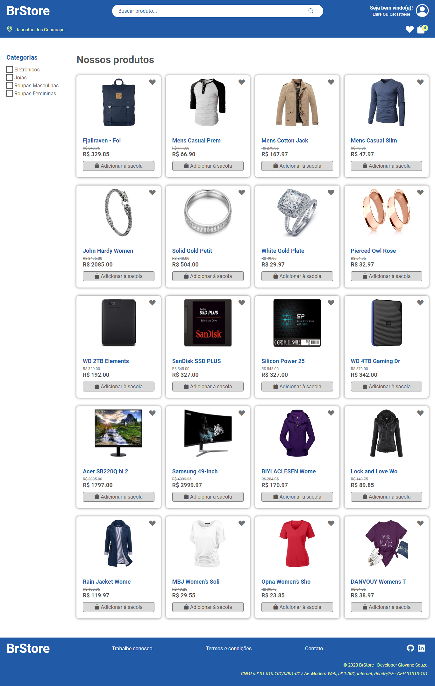
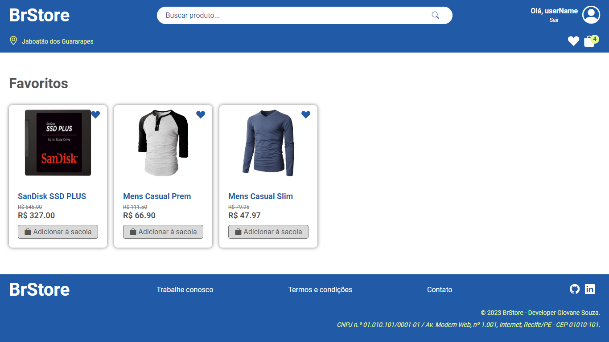
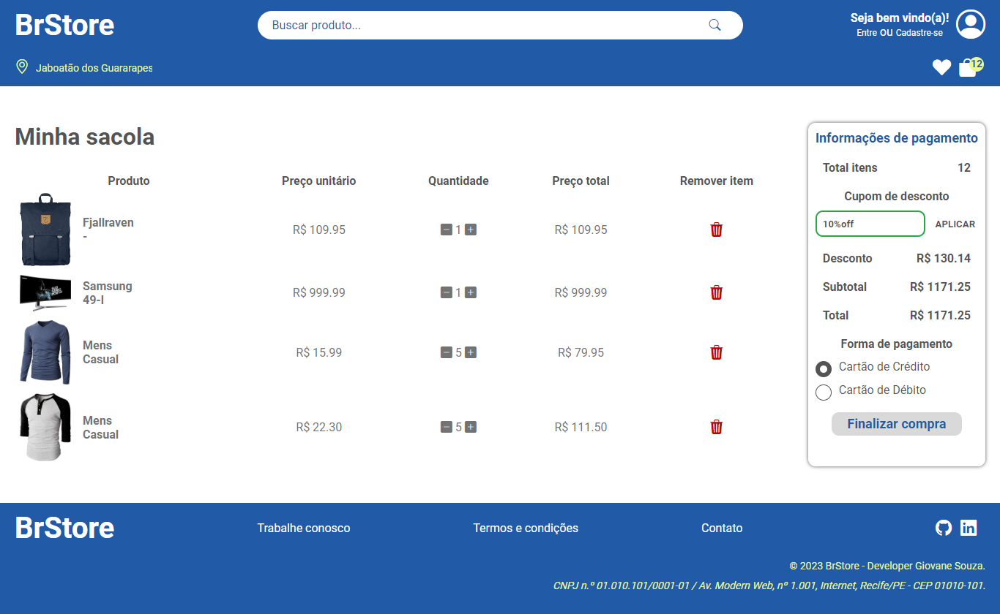
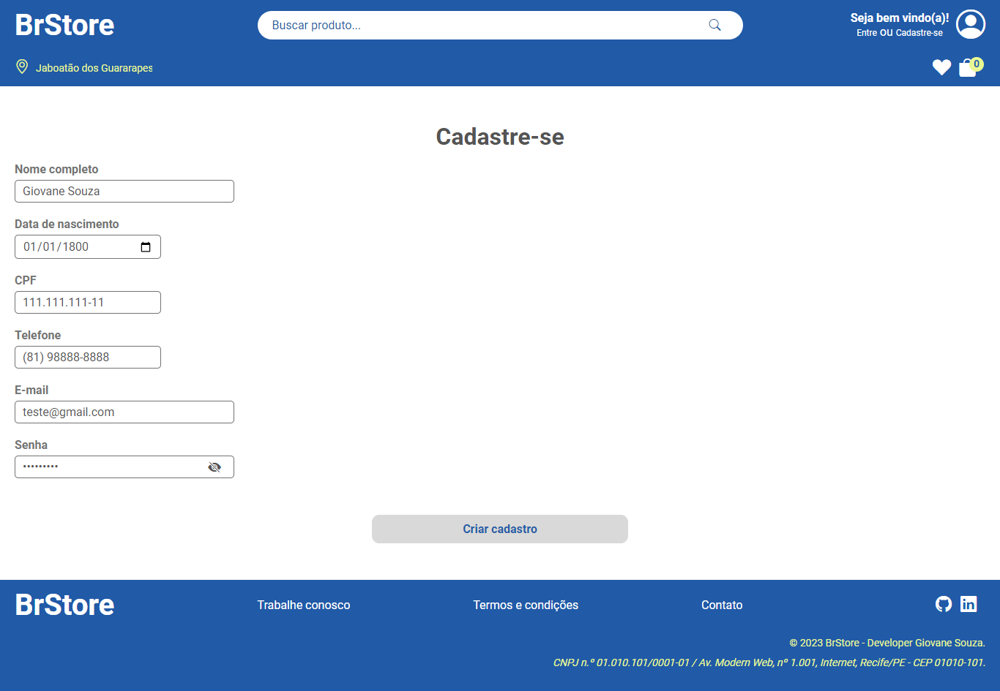
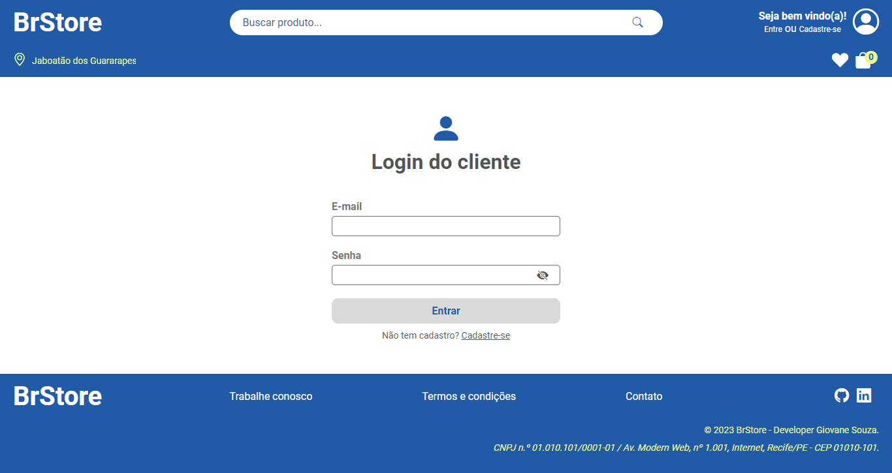
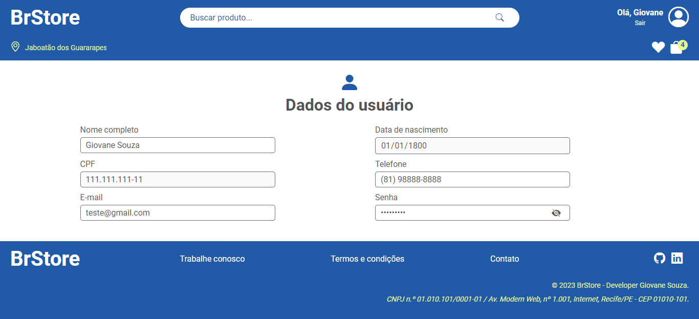
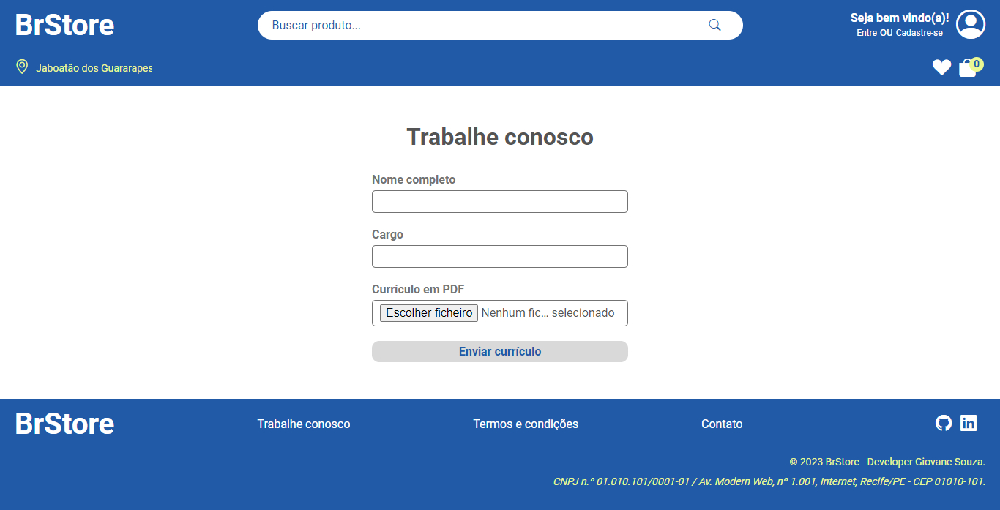
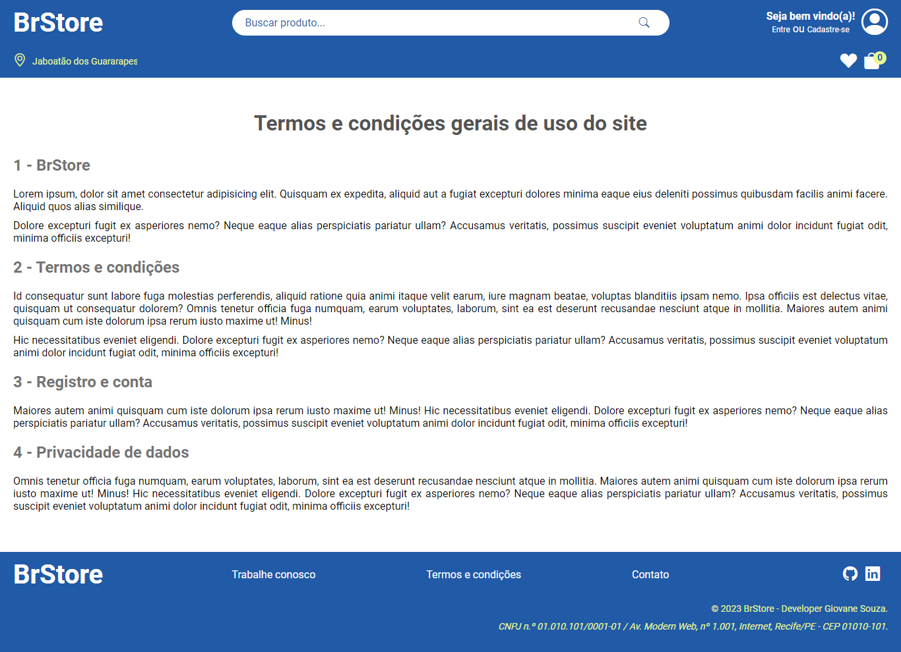
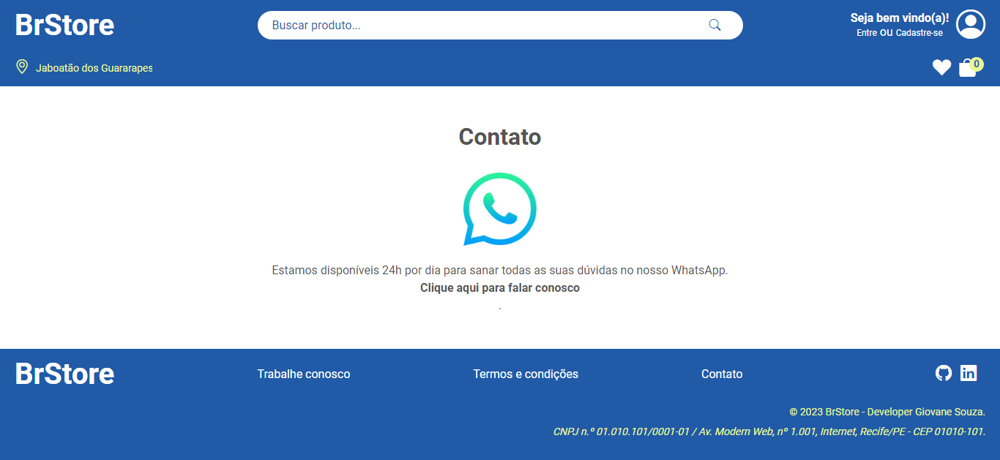

# BrStore

## Sobre o projeto
Projeto desenvolvido como parte avaliativa do curso de Desenvolvedor Full Stack, módulo Modern Web que contempla as tecnologias a seguir:

* HTML5
* CSS3
* JS

Consiste em uma loja virtual, onde é possível visualizar os produtos da loja, adicioná-los aos favoritos e à sacola, realizar cadastro e login, tendo os dados persistidos por meio do localStorage.

Neste projeto foram utilizadas duas APIs:

1. [Via CEP](https://viacep.com.br/)
1. [Fake Store API](https://fakestoreapi.com/)


>[!NOTE]
>
> Os dados do localStorage podem ser vistos por meio das ferramentas do desenvolvedor do navegador por meio da aba **Application** -> **Local Storage**.


## Objetivos do projeto
Criar uma loja virtual funcional aplicando os conhecimentos de Mordern Web.


## Como visualizar o projeto localmente?

### Pré-requesitos:

>[!IMPORTANT]
> 
> * [x] Ter o git instalado na máquina;
> * [x] Ter um editor de código de sua preferência;
> * [x] Rodar o projeto em um servidor local (Sugestão: Utilize a extensão **live server**);
> * [x] Clone o repositório por meio do comando abaixo.


```bash
git clone https://github.com/giovanesouza/BrStore.git
```

## Resultados obtidos:


 - index")









